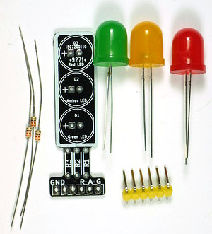
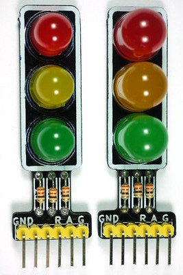

# TrafficLight #

Simple PCB design for a traffic light signal head which can be used
with the Arduino.
Just three LEDs, three resistors and a connector.

## Hardware ##

PCB designed with KiCad
(originally KiCad V3, now updated to V6.0.2).
Either 10mm or 8mm LEDs can be fitted.
Best to select black soldermask,
and make the edges of the PCB black with paint or a marker pen.

The board and the parts needed to assemble it.

Two PCBs, assembled with 8mm and 10mm LEDs.

## Software ##

In the subdirectory 'TrafficLight' there's a very simple Arduino
sketch to make the lights change.
The pins assigned to the LEDs can be changed in the code,
so that the PCB can be plugged directly into an Arduino Uno
or an Arduino Nano.
